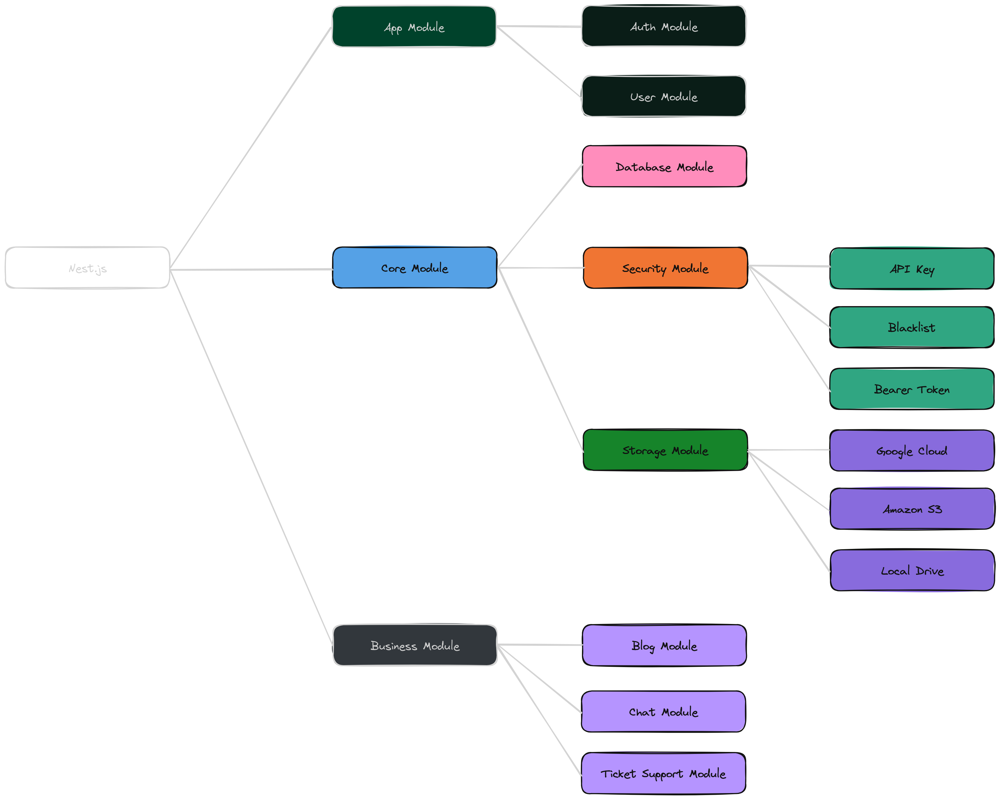

<p align="center">
  <a href="http://nestjs.com/" target="blank"></a>
</p>

<h1 align="center">Azversan</h1>

<p align="center">A progressive <a href="http://nodejs.org" target="_blank">Node.js</a> framework for building efficient and scalable server-side applications.</p>

## Description

The **Nest.js Boilerplate** is a foundational template designed to accelerate the development of scalable and efficient server-side applications. It incorporates commonly used packages, best practices, and modular architecture, making it easy to extend and adapt for various use cases.

This boilerplate is a perfect starting point for building modern, efficient, and maintainable applications with Nest.js.

## Module Pattern



## Project setup

Copy the example environment configuration file to .env:

```bash
$ cp .env.example .env
```

Install all required Node.js packages:

```bash
$ npm install
```

### Environment

```bash
# Database
DB_LOG = false
DB_SYNC = true
DB_MODE = alter
DB_TIME = +00:00

# Security: API Key
API_KEY_AUTH = true
API_KEY_AUTH_KEY_NAME = X-API-KEY

# Security: Blacklist
BLACKLIST_ENABLE = true
DEVICE_ID_KEY_NAME = X-DEVICE-ID

# Security: JWT
JWT_AUTH = true
JWT_SECRET = NestjsBoilerplate
JWT_EXPIRATION = 4h

# Storage: Disk
DISK_STORAGE_ROOT =

# Storage: AWS S3
S3_ENDPOINT =
S3_REGION =
S3_ACCESS_KEY =
S3_SECRET_KEY =
S3_BUCKET =

# Storage: Google Cloud
GCLOUD_KEY_FILE =
GCLOUD_BUCKET =
```

### Environment Configuration Overview

| **Name**                | **Description**                                                                                                                                                                                                                                |
| ----------------------- | ---------------------------------------------------------------------------------------------------------------------------------------------------------------------------------------------------------------------------------------------- |
| `DB_LOG`                | Enables or disables database logging.                                                                                                                                                                                                          |
| `DB_SYNC`               | Enables or disables database synchronization. When set to `true`, the application will synchronize its state with the database.                                                                                                                |
| `DB_MODE`               | Specifies the mode of database operation. The options are: <br> - `alter`: Modifies the database schema without dropping existing data. <br> - `force`: Forces the database to drop existing tables and recreate them, resulting in data loss. |
| `DB_TIME`               | Specifies the time zone for the database. The value `+00:00` represents UTC (Coordinated Universal Time), ensuring that time-related data is stored in a consistent, universal time format across different environments.                      |
| `API_KEY_AUTH`          | Enables or disables API key authentication. When set to `true`, requests must include a valid API key.                                                                                                                                         |
| `API_KEY_AUTH_KEY_NAME` | Specifies the header name that will carry the API key for authentication. The default is `X-API-KEY`, which should be used in requests.                                                                                                        |
| `BLACKLIST_ENABLE`      | Activates the blacklist feature. When set to `true`, clients can be blacklisted based on specific criteria.                                                                                                                                    |
| `DEVICE_ID_KEY_NAME`    | Defines the header name used to transmit the Device ID when implementing the blacklist feature. The default is `X-DEVICE-ID`.                                                                                                                  |
| `JWT_AUTH`              | Enables or disables JSON Web Token (JWT) authentication. When `true`, the application will require JWT for secure access.                                                                                                                      |
| `JWT_SECRET`            | Specifies the secret key used to sign and verify JWT tokens, ensuring their integrity and authenticity. This key should be kept confidential.                                                                                                  |
| `JWT_EXPIRATION`        | Sets the duration for which JWT tokens remain valid. The format is in duration format, such as `4h` for four hours.                                                                                                                            |
| `DISK_STORAGE_ROOT`     | Specifies the root directory for local disk storage. This needs to be set to define where files will be stored.                                                                                                                                |
| `S3_ENDPOINT`           | The endpoint for your S3 storage service. Must be configured to enable interaction with the S3 bucket.                                                                                                                                         |
| `S3_REGION`             | Indicates the AWS region where the S3 bucket is located. Necessary for proper connectivity and access.                                                                                                                                         |
| `S3_ACCESS_KEY`         | The access key required for authenticating requests to your S3 storage. Ensure it is kept secure.                                                                                                                                              |
| `S3_SECRET_KEY`         | The secret key used alongside the access key to authenticate and authorize access to your S3 bucket. Keep it confidential.                                                                                                                     |
| `S3_BUCKET`             | Specifies the name of the S3 bucket where files will be stored. Must be configured for storage functionality.                                                                                                                                  |
| `GCLOUD_KEY_FILE`       | Points to the JSON key file used for authenticating with Google Cloud services. Critical for accessing Google Cloud Storage.                                                                                                                   |
| `GCLOUD_BUCKET`         | Defines the name of the Google Cloud Storage bucket to use for storing files.                                                                                                                                                                  |

## Database Migration & Seeding

Run migrations :

```bash
$ npx sequelize-cli db:migrate --name 1.0.0-base.js
```

Run the demo seeder.

```bash
$ npx sequelize-cli db:seed --seed demo
```

Run the production seeder.

```bash
$ npx sequelize-cli db:seed --seed start
```

## Compile and run the project

```bash
# development
$ npm run start

# watch mode
$ npm run start:dev

# production mode
$ npm run start:prod
```

## Run tests

```bash
# unit tests
$ npm run test

# e2e tests
$ npm run test:e2e

# test coverage
$ npm run test:cov
```

## License

Nest is [MIT licensed](./LICENSE).
